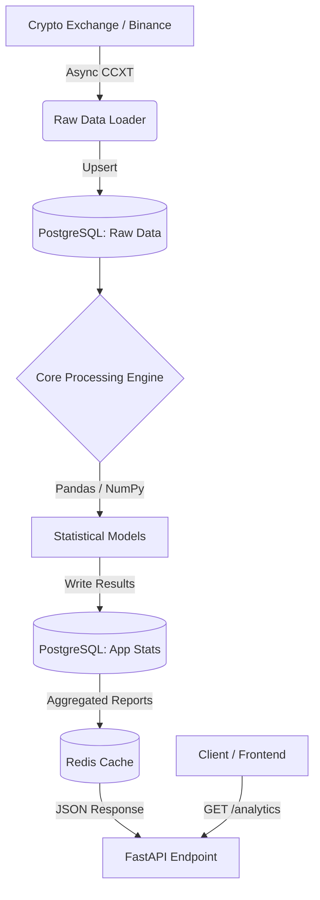

# Equilibrium

**High-Performance Quantitative Trading Analytics Engine**


> **Note:** The dashboard shown above serves as a visualization layer to demonstrate the capabilities of the Equilibrium API. The core of this project—the data pipeline, statistical modeling, and high-frequency API—is the primary focus of this repository.

---

## 📋 Overview

Equilibrium API is a sophisticated backend system designed to ingest, process, and analyze financial market data in real-time. It automates the calculation of complex statistical probabilities used in quantitative trading, such as Initial Balance (IB) breakouts, extension targets, and time-based volatility patterns.

The system relies on a robust **ETL pipeline** that syncs raw OHLCV data, computes derivatives using Pandas, stores them in a relational database, and caches the final reports in Redis for sub-millisecond API response times.

---

## 🗂️ Architecture & Data Flow

The system follows a microservices-ready architecture using Docker containers.



---

## 🛠️ Tech Stack

### Backend & Data Engineering

- **Core:** Python 3.13, Pandas (Time-series analysis)
- **API Framework:** FastAPI, Uvicorn, Pydantic
- **Data Ingestion:** CCXT (Async library for crypto exchanges)
- **Databases:** PostgreSQL (Dual-database setup for Raw Data & Statistics)
- **Caching:** Redis (Async)
- **Scheduling:** APScheduler (CRON jobs for daily updates)
- **ORM:** SQLAlchemy (Async)

### Infrastructure & DevOps

- **Containerization:** Docker & Docker Compose
- **Tooling:** Adminer (DB Management)

---

## 🧩 Key Features

- **Automated ETL Pipeline:** Daily synchronization of market data ensuring zero gaps in history

- **Dual-Layer Storage:** Separation of high-frequency raw data (candles) from analytical data (statistics) for query optimization

- **Smart Integrity & Efficiency Engine (SmartRunner):**
  - **Incremental Ingestion:** The system checks the last recorded timestamp for each asset and downloads only new missing candles (delta sync), minimizing API load
  - **Adaptive Statistics Calculation:**
    - **Append Mode:** Under normal conditions, the system calculates statistics only for the newly closed sessions
    - **Schema Evolution:** If a new metric is added to the codebase (e.g., a new "Breakout Logic"), the system automatically detects missing keys in the JSONB storage and triggers a Full Historical Recalculation to ensure dataset consistency
    - **Self-Healing:** Automatically handles data gaps or integrity issues by re-processing the affected ranges

- **Statistical Models:**
  - **Initial Balance (IB):** Breakout probabilities and false-break detection
  - **Seasonality:** Day-of-week probability analysis (e.g., "Weekday Chop")
  - **Timing Heatmaps:** Distribution of significant market events by time of day

- **Performance:** API endpoints serve pre-computed cached data, handling heavy mathematical loads instantly

---

## 🚀 Getting Started

### Prerequisites

- Docker & Docker Compose

### Installation

1. **Clone the repository**

```bash
git clone https://github.com/Danylo-D87/Equilibrium
cd Equilibrium
```

2. **Configure Environment**

Rename `.env_simple` to `.env` and configure your credentials:

```bash
mv .env_simple .env
```

3. **Run with Docker**

```bash
docker-compose up --build -d
```

4. **Access the API**

- API Docs (Swagger): http://localhost:8000/docs
- Frontend Dashboard: http://localhost:3000
- DB Management (Adminer): http://localhost:8080

---

## 📂 Project Structure

```
├── src
│   ├── data                    # Core Logic & ETL
│   │   ├── add_footprint_to_db # Calculates daily metrics (High/Low, Range) from candles
│   │   ├── analytics/tools     # Generates statistical reports from aggregated daily metrics
│   │   ├── data_loaders        # Orchestrators for Sync, Calc & Cache updates
│   ├── db                      # Database Config & ORM Models (SQLAlchemy)
│   ├── routers                 # FastAPI Route definitions
│   ├── utils                   # Time conversion & Helpers
│   └── main.py                 # Application Entry Point (App & Scheduler)
├── frontend                    # Visualization Dashboard (Next.js/React)
├── docker-compose.yml          # Infrastructure definition (DB, Redis, API, UI)
├── Dockerfile                  # Backend container build instructions
└── requirements.txt            # Python dependencies
```

---

## 📝 Note

This project was created for personal use. Future development will continue privately to preserve the generated market alpha (edge).

---

## License

MIT

